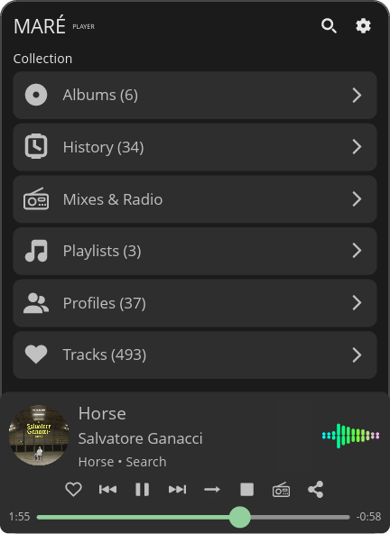
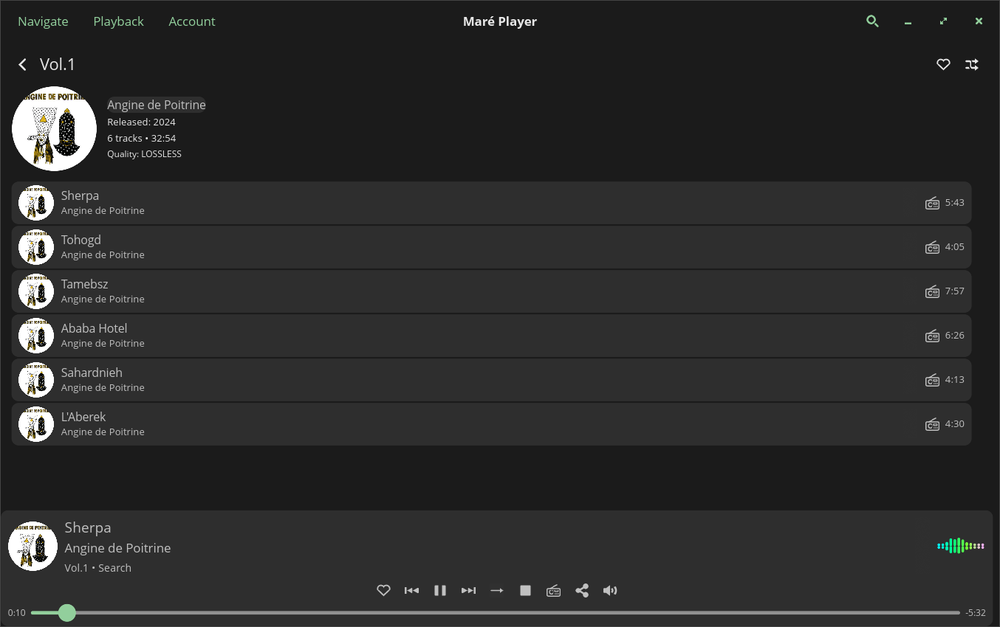

# Maré Player

A COSMIC™ desktop application for the TIDAL music streaming service.
Stream Hi-Res audio, browse your library, and control playback — with
a real-time spectrum visualizer and full MPRIS integration.

Builds as either a **panel applet** (popup from the system panel) or a
**standalone window** (regular application) — chosen at compile time
via the `panel-applet` feature flag (enabled by default).

<table align="center"><tr>
<td></td>
<td></td>
</tr></table>

## Features

- **Hi-Res Audio Playback** — Stream FLAC up to 24-bit/192 kHz via
  DASH, decoded with symphonia and output through PulseAudio
  (pipewire-pulse on modern desktops)
- **Real-time Spectrum Visualizer** — FFT-based stereo frequency
  display in the now-playing bar
- **MPRIS D-Bus Integration** — Control playback from any MPRIS client
  (playerctl, KDE Connect, desktop media keys, etc.)
- **Library Browsing** — Playlists, albums, artists, mixes & radio,
  favorite tracks, followed artists (profiles)
- **Search** — Search tracks, albums, artists, and playlists across
  TIDAL's catalog
- **Track Radio** — Start a radio station from any track
- **Artist Detail** — Bio, top tracks, and discography for any artist
- **Favorites** — Add/remove tracks, albums, and follow/unfollow
  artists
- **Shuffle** — Shuffle play for playlists, albums, mixes, and
  favorites
- **Sharing** — Generate song.link URLs and copy to clipboard
- **Dual Mode** — Builds as a COSMIC panel applet *or* a standalone
  windowed application (`--no-default-features`)
- **Secure Authentication** — OAuth device-code flow with credentials
  stored in the system keyring
- **Persistent Sessions** — Automatic token refresh across reboots
- **Disk Caching** — Songs and images are cached locally with
  configurable size limits and LRU eviction
- **Audio Quality Selection** — Low, High, Lossless, or Hi-Res
  (Master)

## Installation

### Dependencies

Install the required system libraries before building:

```sh
# Fedora / RHEL
sudo dnf install dbus-devel libsecret-devel libxkbcommon-devel pulseaudio-libs-devel

# Ubuntu / Debian
sudo apt install libdbus-1-dev libsecret-1-dev libxkbcommon-dev libpulse-dev

# Arch
sudo pacman -S dbus libsecret libxkbcommon libpulse
```

### Build & Install

Requires Rust 2024 edition (1.85+) and [just](https://github.com/casey/just).

```sh
git clone https://github.com/glima/mare-player.git
cd mare-player

# Panel applet (default — installs into the COSMIC panel)
just build-release
just install

# Standalone window application
just build-release-standalone
just install-standalone
```

## Usage

### First-time Setup

1. Click the Maré Player icon in your panel (or launch the standalone app)
2. Click **Sign in with TIDAL**
3. A URL and code will be displayed
4. Click **Open Browser** to open the TIDAL login page
5. Enter the code and authorize the application
6. Click **I've Signed In** to complete authentication

### Browsing & Playback

- **Collection** — View your playlists, albums, artists, and favorite
  tracks from the main screen
- **Search** — Tap the search icon to find tracks, albums, artists, and
  playlists
- **Mixes & Radio** — Browse your personalized TIDAL mixes
- **Track Radio** — Start a radio station from any track via the radio
  button
- **Artist Detail** — Tap an artist name to see bio, top tracks, and
  discography
- **Now Playing** — Playback controls, seek bar, shuffle, and spectrum
  visualizer
- **MPRIS** — Use media keys or any MPRIS controller (e.g.
  `playerctl play-pause`)
- **Sharing** — Share the currently playing track via song.link
- **Settings** — Audio quality, cache management, and account info via
  the gear icon

## Configuration

Configuration is managed through COSMIC's config system. Available
settings:

| Setting | Description | Default |
|---|---|---|
| Audio Quality | Low / High / Lossless / Hi-Res | Hi-Res |
| Song Cache Limit | Max disk space for cached songs | 2 GB |

## Building

A [justfile](./justfile) provides all common workflows:

| Recipe | Description |
|---|---|
| `just` | Build applet with release profile (default) |
| `just build-release` | Build applet with release profile |
| `just build-debug` | Build applet with debug profile |
| `just build-release-standalone` | Build standalone window app (release) |
| `just build-debug-standalone` | Build standalone window app (debug) |
| `just build-vendored` | Build applet with vendored dependencies |
| `just build-vendored-standalone` | Build standalone with vendored dependencies |
| `just run` | Build and run applet (`RUST_BACKTRACE=full`) |
| `just run-debug` | Build and run applet (debug profile) |
| `just run-standalone` | Build and run standalone (release) |
| `just run-standalone-debug` | Build and run standalone (debug) |
| `just check` | Clippy lint check |
| `just test` | Run tests with cargo-nextest (falls back to cargo test) |
| `just test-verbose` | Tests with immediate stdout/stderr output |
| `just coverage` | HTML + LCOV coverage report via cargo-llvm-cov |
| `just coverage-summary` | Text-only coverage summary |
| `just doc` | Build docs (including private items) |
| `just doc-open` | Build docs and open in browser |
| `just bloat-check` | Analyze binary size by crate/function |
| `just stats` | Code statistics via tokei |
| `just install` | Install applet system-wide |
| `just install-debug` | Install applet (debug build) |
| `just install-standalone` | Install standalone app system-wide |
| `just install-standalone-debug` | Install standalone app (debug build) |
| `just uninstall` | Remove installed files |
| `just clean` | `cargo clean` |
| `just clean-dist` | Clean build artifacts and vendored deps |
| `just vendor` | Vendor dependencies for offline builds |
| `just tag <version>` | Bump version, commit, and create git tag |

## Project Structure

```
src/
├── audio/          # Playback engine, symphonia decoder, PulseAudio output, DASH streaming, FFT spectrum
├── tidal/          # TIDAL API client, OAuth auth, player queue, MPRIS2 D-Bus interface
├── handlers/       # Message handlers: auth, data loading, navigation, playback, misc (images, sharing, MPRIS, screenshots)
├── views/          # UI views
│   ├── components/ # Reusable components: FadingClip widget, icons, constants, list helpers, row builders
│   ├── visualizer  # Audio spectrum visualizer widget
│   └── *.rs        # Panel, popup, albums, artists, playlists, tracks, mixes, search, settings, auth, share, …
└── *.rs            # App model, state, messages, config, disk caching, image cache, helpers, menu
```

## Key Dependencies

| Crate | Purpose |
|---|---|
| [libcosmic](https://github.com/pop-os/libcosmic) | COSMIC application framework |
| [tidlers](https://github.com/tomkoid/tidlers) | TIDAL API client |
| [symphonia](https://github.com/pdeljanov/Symphonia) | Pure-Rust audio decoding (FLAC, AAC, MP3) |
| [libpulse-binding](https://crates.io/crates/libpulse-binding) | PulseAudio async API for playback & volume control |
| [rustfft](https://crates.io/crates/rustfft) | FFT for spectrum analysis |
| [zbus](https://crates.io/crates/zbus) | D-Bus / MPRIS2 interface |
| [keyring](https://crates.io/crates/keyring) | System credential storage |
| [dash-mpd](https://crates.io/crates/dash-mpd) | DASH manifest parsing |
| [reqwest](https://crates.io/crates/reqwest) | HTTP client for streaming |

## Acknowledgments

- Built with [libcosmic](https://github.com/pop-os/libcosmic)
- TIDAL API access via [tidlers](https://github.com/tomkoid/tidlers)

## License

[MIT](LICENSE)

## Disclaimer

TIDAL is a registered trademark of TIDAL Music AS. This is an
unofficial application and is not affiliated with or endorsed by TIDAL.
Use at your own risk and ensure compliance with TIDAL's Terms of
Service.