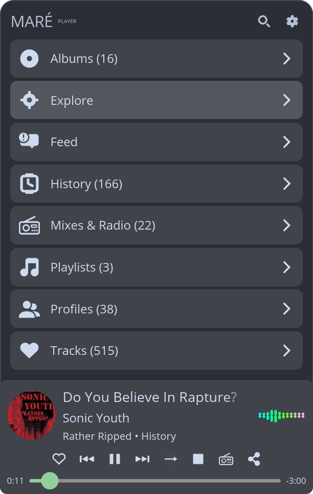
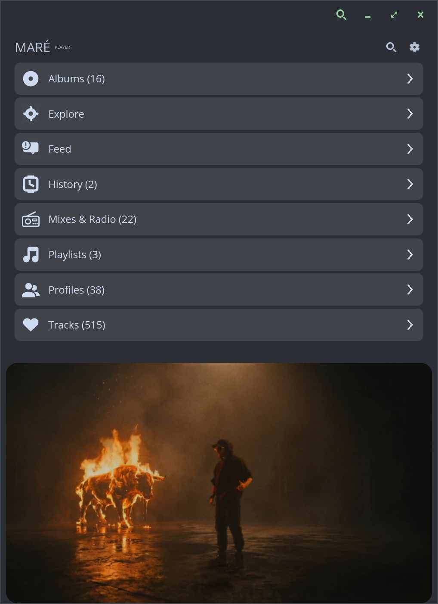

#  Maré Player

[](https://scorecard.dev/viewer/?uri=github.com/glima/mare-player)
[](https://codecov.io/gh/glima/mare-player)
[](https://github.com/glima/mare-player/releases/latest)


A COSMIC™ desktop application for the TIDAL music streaming service.
Stream Hi-Res audio, watch music videos, browse your library, and
control playback — with a real-time spectrum visualizer and full
MPRIS integration.

Builds as either a **panel applet** (popup from the system panel) or a
**standalone window** (regular application) — chosen at compile time
via the `panel-applet` feature flag (enabled by default).

<table align="center">
<tr>
<td align="center"></td>
<td align="center"></td>
</tr>
<tr>
<td align="center"><sub>Panel Applet mode</sub></td>
<td align="center"><sub>Standalone Window mode (playing video)</sub></td>
</tr>
</table>

## Features

- **Hi-Res Audio Playback** — Stream FLAC up to 24-bit/192 kHz (DASH),
  played through GStreamer (PipeWire/PulseAudio output)
- **Music Video Playback** — Play TIDAL music videos (HLS, H.264/AAC)
  through a GStreamer pipeline, shown in an auto-hiding "theater" HUD
  with the same clickable title/artist/context and transport controls
  as the audio bar
- **Gapless Playback** — The next track is preloaded and decoded ahead
  of time for seamless, gap-free transitions
- **Volume Normalization** — Per-track replay-gain is applied so tracks
  play back at a consistent loudness
- **Real-time Spectrum Visualizer** — FFT-based stereo frequency
  display in the now-playing bar, driven by a PCM tap on the GStreamer
  playback pipeline (audio tracks and music videos alike)
- **MPRIS D-Bus Integration** — Control playback from any MPRIS client
  (playerctl, KDE Connect, desktop media keys, etc.)
- **Library Browsing** — Playlists, albums, artists, mixes & radio,
  favorite tracks, followed artists (profiles)
- **Explore** — Browse TIDAL's curated pages: a Featured carousel plus
  Genres, Moods & Activities, Decades, and more, with recursive
  drill-down navigation
- **Activity Feed** — New releases from the artists you follow, grouped
  by time period
- **Search** — Search tracks, albums, artists, and playlists across
  TIDAL's catalog
- **Track Radio** — Start a radio station from any track
- **Track Recommendations** — A per-track detail page with the artist's
  discography, related albums, and related artists
- **Lyrics** — Time-synced lyrics that highlight the current line (with
  a plain-text fallback when only flat lyrics are available)
- **Play History** — A locally-tracked, searchable list of recently
  played tracks
- **Artist Detail** — Bio, top tracks, and discography for any artist
- **Favorites** — Add/remove tracks, albums, and follow/unfollow
  artists
- **Shuffle** — Shuffle play for playlists, albums, mixes, and
  favorites
- **Sharing** — Generate song.link URLs and copy to clipboard
- **Dual Mode** — Builds as a COSMIC panel applet *or* a standalone
  windowed application (`--no-default-features`)
- **Secure Authentication** — OAuth device-code flow with credentials
  stored in the system keyring
- **Persistent Sessions** — Automatic token refresh across reboots
- **Disk Caching** — Songs and images are cached locally with
  configurable size limits and LRU eviction
- **Audio Quality Selection** — Low, High, Lossless, or Hi-Res
  (Master)

## Installation

### Dependencies

Install the required system libraries before building:

```sh
# Fedora / RHEL
sudo dnf install dbus-devel libsecret-devel libxkbcommon-devel \
    gstreamer1-devel gstreamer1-plugins-base-devel

# Ubuntu / Debian
sudo apt install libdbus-1-dev libsecret-1-dev libxkbcommon-dev \
    libgstreamer1.0-dev libgstreamer-plugins-base1.0-dev

# Arch
sudo pacman -S dbus libsecret libxkbcommon gstreamer gst-plugins-base
```

#### Playback codecs (runtime)

All playback — audio tracks **and** music videos — runs through GStreamer, so
the demuxers/decoders from the good/bad/libav plugin sets are required at
runtime: FLAC/AAC/MP3 for audio (DASH/HLS), and H.264 for video.

```sh
# Fedora / RHEL (avdec_* come from RPM Fusion's gstreamer1-libav)
sudo dnf install gstreamer1-plugins-good gstreamer1-plugins-bad-free gstreamer1-libav

# Ubuntu / Debian
sudo apt install gstreamer1.0-plugins-good gstreamer1.0-plugins-bad gstreamer1.0-libav

# Arch
sudo pacman -S gst-plugins-good gst-plugins-bad gst-libav
```

### Build & Install

Requires Rust 2024 edition (1.85+) and [just](https://github.com/casey/just).

```sh
git clone https://github.com/glima/mare-player.git
cd mare-player

# Panel applet (default — installs into the COSMIC panel)
just build-release
just install

# Standalone window application
just build-release-standalone
just install-standalone
```

## Usage

### First-time Setup

1. Click the Maré Player icon in your panel (or launch the standalone app)
2. Click **Sign in with TIDAL**
3. A URL and code will be displayed
4. Click **Open Browser** to open the TIDAL login page
5. Enter the code and authorize the application
6. Click **I've Signed In** to complete authentication

### Browsing & Playback

- **Collection** — View your playlists, albums, artists, and favorite
  tracks from the main screen
- **Search** — Tap the search icon to find tracks, albums, artists, and
  playlists
- **Explore** — Browse TIDAL's curated pages (genres, moods, decades,
  featured) with drill-down navigation
- **Mixes & Radio** — Browse your personalized TIDAL mixes
- **Feed** — See new releases from the artists you follow
- **History** — Revisit recently played tracks (searchable)
- **Track Radio** — Start a radio station from any track via the radio
  button
- **Music Videos** — Video tracks (marked with a video badge) play in a
  full-area theater whose controls and track info auto-hide; move the
  pointer to bring them back
- **Lyrics** — Open the lyrics view for the current track; synced
  lyrics highlight the active line
- **Artist Detail** — Tap an artist name to see bio, top tracks, and
  discography
- **Track Detail** — Tap a track title to see related albums and
  artists seeded from it
- **Now Playing** — Playback controls, seek bar, shuffle, and spectrum
  visualizer
- **MPRIS** — Use media keys or any MPRIS controller (e.g.
  `playerctl play-pause`)
- **Sharing** — Share the currently playing track via song.link
- **Settings** — Audio quality, cache management, and account info via
  the gear icon

## Configuration

Configuration is managed through COSMIC's config system. Available
settings:

| Setting | Description | Default |
|---|---|---|
| Audio Quality | Low / High / Lossless / Hi-Res | Hi-Res |
| Song Cache Limit | Max disk space for cached songs | 2 GB |
| Image Cache Limit | Max disk space for cached artwork | 200 MB |

The playback volume is also persisted across restarts.

## Building

A [justfile](./justfile) provides all common workflows:

| Recipe | Description |
|---|---|
| `just` | Build applet with release profile (default) |
| `just build-release` | Build applet with release profile |
| `just build-debug` | Build applet with debug profile |
| `just build-release-standalone` | Build standalone window app (release) |
| `just build-debug-standalone` | Build standalone window app (debug) |
| `just build-vendored` | Build applet with vendored dependencies |
| `just build-vendored-standalone` | Build standalone with vendored dependencies |
| `just run` | Build and run applet (`RUST_BACKTRACE=full`) |
| `just run-debug` | Build and run applet (debug profile) |
| `just run-standalone` | Build and run standalone (release) |
| `just run-standalone-debug` | Build and run standalone (debug) |
| `just check` | Clippy lint check |
| `just test` | Run tests with cargo-nextest (falls back to cargo test) |
| `just test-verbose` | Tests with immediate stdout/stderr output |
| `just coverage` | HTML + LCOV coverage report via cargo-llvm-cov |
| `just coverage-summary` | Text-only coverage summary |
| `just doc` | Build docs (including private items) |
| `just doc-open` | Build docs and open in browser |
| `just bloat-check` | Analyze binary size by crate/function |
| `just stats` | Code statistics via tokei |
| `just install` | Install applet system-wide |
| `just install-debug` | Install applet (debug build) |
| `just install-standalone` | Install standalone app system-wide |
| `just install-standalone-debug` | Install standalone app (debug build) |
| `just uninstall` | Remove installed files |
| `just clean` | `cargo clean` |
| `just clean-dist` | Clean build artifacts and vendored deps |
| `just vendor` | Vendor dependencies for offline builds |
| `just tag <version>` | Bump version, commit, and create git tag |

## Project Structure

```
src/
├── playback/       # GStreamer engine (MediaPlayer): audio + video playbin, replay-gain volume, tee'd PCM tap, RGBA video appsink, gapless
├── audio/          # FFT spectrum analyzer (fed by the playback PCM tap)
├── tidal/          # TIDAL API client, OAuth auth, player queue, MPRIS2 D-Bus interface
├── handlers/       # Message handlers: auth, data loading, navigation, playback, misc (images, sharing, MPRIS, screenshots)
├── views/          # UI views
│   ├── components/ # Reusable components: FadingClip widget, icons, constants, list helpers, row builders
│   ├── visualizer  # Audio spectrum visualizer widget
│   └── *.rs        # Panel, popup, albums, artists, playlists, tracks, track detail, mixes, search, explore, feed, history, lyrics, profiles, settings, auth, share, …
└── *.rs            # App model, state, messages, config, disk caching, image cache, helpers, menu
```

## Key Dependencies

| Crate | Purpose |
|---|---|
| [libcosmic](https://github.com/pop-os/libcosmic) | COSMIC application framework |
| [tidlers](https://github.com/tomkoid/tidlers) | TIDAL API client |
| [gstreamer-rs](https://gitlab.freedesktop.org/gstreamer/gstreamer-rs) | Playback engine for all audio and video (decode, stream, output, volume, seek, gapless) |
| [rustfft](https://crates.io/crates/rustfft) | FFT for spectrum analysis |
| [zbus](https://crates.io/crates/zbus) | D-Bus / MPRIS2 interface |
| [keyring](https://crates.io/crates/keyring) | System credential storage |
| [reqwest](https://crates.io/crates/reqwest) | HTTP client for API requests |
| [image](https://crates.io/crates/image) | Decoding/processing album & video artwork |

## Acknowledgments

- Built with [libcosmic](https://github.com/pop-os/libcosmic)
- TIDAL API access via [tidlers](https://github.com/tomkoid/tidlers)

## License

[MIT](LICENSE)

## Disclaimer

TIDAL is a registered trademark of TIDAL Music AS. This is an
unofficial application and is not affiliated with or endorsed by TIDAL.
Use at your own risk and ensure compliance with TIDAL's Terms of
Service.
